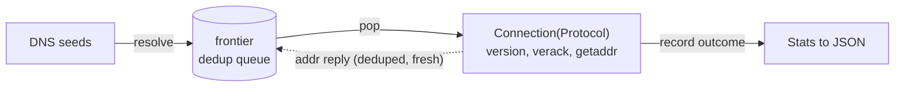

<div align="center">

# ₿ btz

**A fast, single-binary crawler for the Bitcoin peer-to-peer network.**

[](https://ziglang.org)
[](LICENSE)
[](#requirements)
[](#requirements)

</div>

---

`btz` bootstraps from the DNS seeds, speaks the `version` / `verack` handshake to
every node it can reach, asks each one for more addresses (`getaddr`), follows
those, and prints a JSON summary of what the network looks like — how many nodes
answered, which implementations they run, which protocol version and service
flags they advertise, and how many addresses turned up along the way.

It runs on a hand-rolled `io_uring` event loop — **one thread, one ring,
hundreds to thousands of connections in flight** — and follows
[TigerStyle](TIGER_STYLE.md): fixed limits on everything, no heap allocation
after start-up, assertions throughout.

- 🌐 **mainnet, testnet3, signet** — one flag switches magic, port, and seeds
- ⚡ **`io_uring`, single-threaded** — concurrency is *N* state machines, not *N* threads
- 🧭 **frontier + dedup** — discovered addresses feed back in; nothing is dialed twice
- ⏱️ **two-phase deadlines** — a tight budget to connect, a longer one to wait out `getaddr`
- 📊 **JSON out** — one object, pipes straight into `jq`
- 🪶 **zero dependencies** — just the Zig toolchain

```json
{
  "dialed": 2000,
  "reachable": 233,
  "reachable_pct": 11.7,
  "failures": {
    "ConnectTimeout": 1450,
    "ConnectionRefused": 190,
    "HostUnreachable": 96,
    "EndOfStream": 24,
    "ConnectionResetByPeer": 7
  },
  "clients": {
    "Core": 205,
    "Knots": 24,
    "btcd": 2,
    "Unknown": 2
  },
  "protocol_versions": {
    "70016": 229,
    "70015": 3,
    "70014": 1
  },
  "features": {
    "NODE_NETWORK_LIMITED": 233,
    "NODE_WITNESS": 220,
    "NODE_NETWORK": 210,
    "NODE_P2P_V2": 188,
    "NODE_BLOOM": 41,
    "NODE_COMPACT_FILTERS": 39,
    "(other bits)": 12
  },
  "discovery": {
    "unique_addresses_found": 18352,
    "addresses_disclosed": 451233,
    "peers_sharing": 140
  }
}
```

---

## Contents

- [Requirements](#requirements)
- [Build, test, format](#build-test-format)
- [Usage](#usage)
- [Options](#options)
- [Output](#output)
- [How it works](#how-it-works)
- [Why so many failures?](#why-so-many-failures)
- [Limitations](#limitations)
- [License](#license)

---

## Requirements

| | |
|---|---|
| **Zig** | `0.16.0` exactly — pinned in [`.zigversion`](.zigversion) and `build.zig.zon`. Zig's `std` and build system move between releases. |
| **OS** | **Linux.** The event loop is `io_uring`; `src/io.zig` and `src/connection.zig` `@compileError` elsewhere. Any kernel with `IORING_TIMEOUT_UPDATE` (5.11+) works. |
| **Network** | outbound TCP to arbitrary hosts on port 8333 and the addr-list ports. No inbound needed. |
| **Dependencies** | none — only the Zig toolchain. |

## Build, test, format

```sh
zig build                  # debug binary  -> zig-out/bin/btz
zig build --release        # ReleaseSafe   -> zig-out/bin/btz
zig build run -- --help    # build and run, args after --

zig build test             # unit tests
zig fmt --check .           # style check
```

CI runs `zig fmt --check`, `zig build --release`, and `zig build test` on every
push and pull request.

### With Nix

A [`flake.nix`](flake.nix) pins Zig `0.16.0` (via `zig-overlay`) and adds `zls`.
Needs flakes enabled (`experimental-features = nix-command flakes` in `nix.conf`,
or pass `--extra-experimental-features 'nix-command flakes'`).

**From nothing — install Nix and run the crawler in one shot** (asks for your
sudo password once):

```sh
curl --proto '=https' --tlsv1.2 -sSf -L https://install.determinate.systems/nix | sh -s -- install --no-confirm && \
. /nix/var/nix/profiles/default/etc/profile.d/nix-daemon.sh && \
nix run --no-write-lock-file --extra-experimental-features 'nix-command flakes' \
  github:wesleycremonini/btz -- --dials 2000 --concurrency 512
```

**With Nix already installed:**

```sh
nix develop                        # shell with the pinned zig + zls on PATH
nix build                          # -> ./result/bin/btz
nix run .                          # build and run
nix run . -- --dials 2000 | jq     # args after --

nix run github:wesleycremonini/btz -- --help   # no checkout needed
```

> [!NOTE]
> `flake.lock` is not committed yet, so `nix run github:…` needs
> `--no-write-lock-file`. Commit one once and the flag goes away:
> `nix flake lock && git add flake.lock && git commit -m "Add flake.lock"`.

With [`direnv`](https://direnv.net): `echo 'use flake' > .envrc && direnv allow`
drops you into the dev shell on `cd`.

## Usage

```sh
# a quick sample of the network (~30 s)
btz --dials 4000 --concurrency 1024

# collect ~3000 reachable nodes, giving slow links more time
btz --ok-target 3000 --dials 200000 --concurrency 1024 \
    --connect-timeout-ms 5000 --getaddr-timeout-ms 20000 \
    --frontier-capacity 262144 --seen-capacity 2097152 --ring-entries 16384

# crawl testnet3 instead
btz --network testnet3 --dials 5000

# the JSON goes to stdout as well as --out, so it pipes
btz --dials 2000 | jq '.clients'
```

The summary is written to `--out` (default `btz.log`, truncated each run) **and**
echoed to stdout. Progress and diagnostics go to **stderr**, so `btz … | jq`
works cleanly. Per-step handshake chatter is silenced by default (the `.p2p` log
scope is pinned to `warn`); a debug build additionally prints per-seed
resolution counts.

Exit status is `0` on a completed crawl, `2` for a bad flag, and non-zero if
zero nodes were reachable or the seeds could not be resolved.

## Options

Run `btz --help` for the current list. Every value that sizes an internal buffer
has a compile-time ceiling; a run only touches the prefix its flags select, so
the ceilings are generous and cost nothing unused.

| Flag | Default | Notes |
|---|---|---|
| `--network <name>` | `mainnet` | `mainnet` (8333), `testnet3` (18333), or `signet` (38333) — selects the wire magic, port, and DNS seed list |
| `--concurrency <n>` | `512` | conversations in flight at once; max `2048`. Each is one socket and a ~40 KiB slot |
| `--dials <n>` | `2000` | address dials to start before stopping; max `10_000_000` |
| `--ok-target <n>` | `0` | stop starting dials once this many succeed; `0` = no limit |
| `--connect-timeout-ms <n>` | `3000` | deadline for TCP connect **plus** the `version` / `verack` handshake; max `600_000` |
| `--getaddr-timeout-ms <n>` | `15000` | deadline for the peer's `addr` reply, measured from `verack`; max `600_000` |
| `--addr-max-age-days <n>` | `10` | drop `addr` entries whose timestamp is older than this before dialing them |
| `--out <path>` | `btz.log` | JSON summary is written here (also to stdout) |
| `--user-agent <string>` | `/btz:0.1.0/` | what we advertise in our own `version` (BIP-14); 1–256 bytes |
| `--protocol-version <n>` | `70016` | advertised protocol version |
| `--services <n\|0xHEX>` | `0` | advertised service bits; `0` = `NODE_NONE` (we serve nothing) |
| `--frontier-capacity <n>` | `16384` | pending-dial queue size; max `262144` |
| `--seen-capacity <n>` | `262144` | dedup table size; **power of two**, max `2097152` |
| `--ring-entries <n>` | `8192` | `io_uring` submission-queue depth; **power of two**, max `32768` |

> [!TIP]
> **Time is dominated by dead hosts.** Roughly 85–90 % of dials time out — those
> addresses are offline or outbound-only. A short `--connect-timeout-ms` frees
> those slots fast; high `--concurrency` keeps them from stalling the crawl.
> Bumping the connect timeout to 5 s recovers some genuinely-alive nodes on slow
> links, at the cost of a slower run.

> [!TIP]
> **`--getaddr-timeout-ms` only changes how many addresses you harvest**, not the
> reachable count. Bitcoin Core answers `getaddr` on a delayed relay timer
> (poisson, mean ~30 s), so a wider window collects more; a peer that never
> replies still counts as reachable with zero disclosed.

> [!TIP]
> **The crawl usually stops early** because the frontier drains — it has dialed
> every unique address it could discover. More reachable nodes means running
> again (the DNS seeds rotate their answers) and unioning the results, not
> raising `--dials`. And `--seen-capacity` is the hard ceiling on how far one run
> reaches: once the dedup table is ~full, new discoveries are silently dropped.

## Output

One JSON object. Keys are stable; every breakdown is a `{ "<value>": <count> }`
map ordered most-frequent-first, with an `"(other)"` bucket if a category
overflowed its fixed table.

| Field | Meaning |
|---|---|
| `dialed` | dial attempts made (a conversation started, or the socket failed to open) |
| `reachable` | attempts that completed the `version` / `verack` handshake |
| `reachable_pct` | `reachable / dialed`, one decimal |
| `failures` | count per failure reason, over the `dialed − reachable` that failed |
| `clients` | for reachable peers: implementation, classified from the user agent |
| `protocol_versions` | for reachable peers: the advertised protocol version |
| `features` | for reachable peers: **one count per service flag** — a peer contributes to every flag it sets |
| `discovery.unique_addresses_found` | distinct new addresses enqueued from `addr` replies (excludes seeds) |
| `discovery.addresses_disclosed` | total addresses across all `addr` replies, before dedup |
| `discovery.peers_sharing` | reachable peers that returned at least one address |

> [!NOTE]
> **`reachable` is generous.** A peer is counted the moment `verack` is received.
> If it then hangs up, resets, or never answers `getaddr`, it is *still* counted
> (with zero disclosed addresses) — a node that completed the handshake is a
> running Bitcoin node. Only failures *before* `verack` land in `failures`.

<details>
<summary><b>Failure reasons</b></summary>

| Reason | Cause |
|---|---|
| `ConnectTimeout` | no answer to the SYN, or the handshake stalled, within `--connect-timeout-ms` — offline or firewalled |
| `ConnectionRefused` | host is up, nothing listening on that port |
| `ConnectionResetByPeer` | peer sent RST — often at its inbound-connection limit, or not a Bitcoin service |
| `HostUnreachable` / `NetworkUnreachable` | no route (ICMP unreachable) |
| `EndOfStream` | peer closed the connection during the handshake |
| `MagicMismatch` | first message had the wrong network magic — an altcoin or wrong-network node |
| `ChecksumMismatch` / `MalformedVersion` / `MessageTooLarge` | the peer's `version` did not parse |
| `TooManyCompletions` | a peer flooded us with messages past the per-conversation cap |
| `SocketUnavailable` | the local socket could not be created or started (fd limit) |
| `Canceled` / `Unexpected` | the kernel cancelled the op / an unclassified `io_uring` errno |

</details>

<details>
<summary><b>Client labels</b></summary>

`Core`, `Knots`, `btcd`, `Bitcore`, `libbitcoin`, `Unlimited`, `UASF`, `bcoin`,
`Classic`, `CKCoinD`, `Utreexo`, `Unknown`. Classified by substring, with the
Core-derived forks (which still say `Satoshi` in their agent) matched before
plain Core.

</details>

<details>
<summary><b>Service flags</b></summary>

The bits a node sets in `version.services` to advertise what it will serve
(Bitcoin Core's `ServiceFlags`):

| Bit | Value | Flag | Meaning |
|--:|--:|---|---|
| 0 | `0x001` | `NODE_NETWORK` | serves the full chain |
| 1 | `0x002` | `NODE_GETUTXO` | BIP-64 (effectively dead) |
| 2 | `0x004` | `NODE_BLOOM` | BIP-37 bloom filters |
| 3 | `0x008` | `NODE_WITNESS` | serves segwit data (BIP-144) |
| 4 | `0x010` | `NODE_XTHIN` | Xthin blocks (not Core) |
| 6 | `0x040` | `NODE_COMPACT_FILTERS` | serves BIP-157/158 filters |
| 10 | `0x400` | `NODE_NETWORK_LIMITED` | pruned: only the last ~288 blocks (BIP-159) |
| 11 | `0x800` | `NODE_P2P_V2` | BIP-324 encrypted transport |

Any bit outside this set folds into `(other bits)`. `NODE_NETWORK` lower than
`NODE_NETWORK_LIMITED` means some peers are pruned; a rising `NODE_P2P_V2` tracks
BIP-324 adoption.

</details>

## How it works

A single thread drives one `io_uring` ring. There is no `std.Io` implementation
and no thread pool — concurrency is *N* state machines with SQEs in flight on the
same ring.



1. **Bootstrap** — `collect_seed_addresses` resolves the network's DNS seeds
   (synchronously, before the ring starts) into the **frontier**: a fixed-
   capacity FIFO of addresses to dial, paired with an open-addressing set of
   every IPv4 ever enqueued so nothing is dialed twice.

2. **The crawl loop** (`crawl.connect_all`) keeps `--concurrency` slots busy: pop
   an address, open a socket, start a `Connection`. When a slot settles it folds
   the outcome into `Stats`, pushes the addresses the peer disclosed back onto
   the frontier, and refills the slot. It stops starting new dials once
   `--dials` is reached, `--ok-target` succeed, or the frontier is empty — then
   drains the ring.

3. **The transport** (`connection.zig`) is generic: `Connection(Protocol)` owns
   the fd, five completions, and a re-armable deadline, and runs the
   `idle → dialing → winding → closing → settled` lifecycle. It knows nothing
   about Bitcoin — it feeds bytes and events to a `Protocol` and acts on the
   `Directive` it returns (`recv`, `send`, `done`, `fail`).

4. **The protocol** (`session.zig`) is a pure state machine: send our `version`,
   read the peer's, reply `verack`, read theirs, send `getaddr`, collect the
   IPv4 addresses from the first `addr` reply (≤ 256 per peer, filtered by
   `--addr-max-age-days`).

5. **Two-phase deadline** — the connect + handshake phase runs on
   `--connect-timeout-ms`. When `verack` lands, the timer is re-armed in place
   (`IORING_TIMEOUT_UPDATE`, one CQE, no second timer) to `--getaddr-timeout-ms`.
   A pre-`verack` expiry is `ConnectTimeout`; a post-`verack` expiry just ends
   the conversation with whatever was collected.

6. **Memory** — `slots`, the frontier queue, and the seen-table are static
   arrays sized to their compile-time ceilings and sliced to the flag values at
   start-up. Nothing is allocated after that.

## Why so many failures?

> [!NOTE]
> This is expected, not a bug. `addr` gossip is dominated by dead entries: nodes
> share every peer they have ever seen, most of which are **outbound-only** (they
> connect out, never accept in — your SYN gets no answer) or have since gone
> offline. Public crawlers consistently find only ~10–15 % of gossiped addresses
> reachable, and the rate falls the further you crawl from the seeds (≈18 % on
> the first few thousand dials, ≈2 % deep in). A run ends when the frontier
> drains — it has dialed the whole reachable address graph it could see. The
> useful outputs are `reachable` and `discovery`; a low `reachable_pct` on a
> large `--dials` is the network being mostly-unreachable-by-gossip, working as
> intended.

## Limitations

- **IPv4 only.** `addr` entries that are native IPv6, Tor, I2P, or CJDNS are
  skipped, and the dialer only opens `AF_INET` sockets — a large share of the
  network is invisible to it.
- **Legacy `addr` only.** We never send `sendaddrv2`, so peers reply with the
  pre-BIP-155 `addr` message.
- **Single pass, no persistence.** The seen-set is fresh each run; two
  invocations share nothing. Full coverage takes repeated runs (the DNS seeds
  return a rotating set) unioned by the caller.
- **Linux only** (`io_uring`).

## License

[MIT](LICENSE) © Wesley Cremonini
